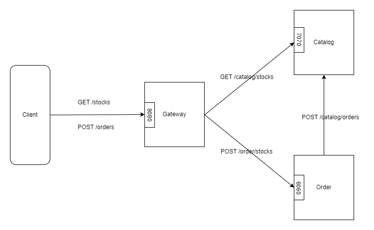

# Example Application



This is a simple application that provides look up and trade functionality for three shares, `NXTI`, `SOLBIO`, and `QXIL`.
The application consists of three microservices:

### 1. Gateway 

It receives requests from clients and based on the type of the requests, call the order or catalog service to process
and response to the request. It exposes two endpoints to the clients:

1. `GET /stocks/<stock_name>`

This endpoint looks up the details of a stock. The below is the request to and response from the end-point.

Request: `GET /stocks/NXTI`

Response: 

    ```json
    {
        "data": {
            "name": "NXTI",
            "price": 210.19,
            "quantity": 8000
        }
    }
    ```

2. `POST /orders`

This endpoint trades stocks. The end-point expect a JSON body with the information needed for the order. The below is
an example of the request body.

    ```json
    {
        "name": "NXTI",
        "quantity": 1,
        "type": "sell"
    }
    ```

The below is an example of a response from the endpoint.

    ```json
    {
        "data": {
            "transaction_number": 1
        }
    }
    ```

### 2. Order Service

The order service exposes one API.

1. `POST /order/orders`

This API places an order for a stock. The request includes a JSON to provide the information needed for the order. The
body has three fields `name`, `quantity`, and `type`. For instance,

```
    {
        "name": "NXTI",
        "quantity": 1,
        "type": "sell"
    }
```

The below is an example of a response from the end-point.

```
    {
        "data": {
        "transaction_number": 10
        }
    }
```

This end-point is exposed for the gateway service so that it can call this end-point and trade a stock.

### 3. Catalog Service

The catalog service exposes two APIs.

1. `GET /catalog/stocks/<stock_name>`

This API is used to look up the details of a stock. The below is an example of a response from the endpoint.

```
    {
        "data": {
            "name": "NXTI",
            "price": 210.19,
            "quantity": 8000
        }
    }
```

This endpoint is exposed for the frontend service so that it can call this endpoint and look up a stock.

2. `POST /catalog/orders`

This API places an order for a certain stock. A JSON body is provided to the POST request to provide the information
needed for the order. The body has three fields `name`, `quantity`, and `type`. For instance,

```
    {
        "name": "NXTI",
        "quantity": 1,
        "type": "sell"
    }
```

The service returns 200 status code without a body.

This end-point is exposed for the order service so that it can call this end-point and trade stocks.


## How to run

1. Go to `example` directory
2. Run `docker compose build`
3. Run `docker compose up`

Now, the gateway server will be listening at 8080 waiting for requests. You can hit the APIs by CURL, Postman, or by
other methods.